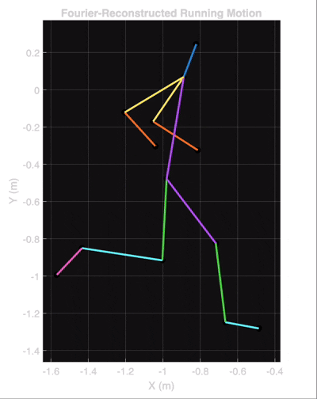

# Fourier Running Analysis

A MATLAB project exploring how Fourier analysis can be used to reconstruct and visualize human running motion.

## Overview

This project began as an optional physics project exploring Fourier series and their ability to represent complicated motion as combinations of simple periodic motions.

For the project, I recorded a teammate running on a treadmill in slow motion and tracked the positions of several joints over time. I then used MATLAB to analyze the resulting motion with the Fast Fourier Transform (FFT) and reconstruct the joint trajectories using a small number of dominant Fourier components.

The goal of the project was primarily conceptual: to build intuition for Fourier analysis and find a creative way to apply it to real-world human motion, rather than to demonstrate advanced programming techniques.

## What the Project Does

### 1. Fourier Motion Analysis

The coordinates of several body points are treated as time-dependent signals:

`x(t)` and `y(t)`

The tracked points include the:

- Wrist
- Elbow
- Shoulder
- Ear
- Hip
- Knee
- Ankle
- Toe

For each coordinate, the FFT is used to identify dominant frequencies in the motion. A limited number of these Fourier components are then used to reconstruct the original trajectory.

Conceptually, each coordinate can be represented as a sum of oscillations:

`x(t) = mean + A1*cos(2*pi*f1*t + φ1) + A2*cos(2*pi*f2*t + φ2) + ...`

and similarly for `y(t)`.

This provides a visual way to see how complicated biomechanical motion can be approximated using combinations of simple periodic functions.

### 2. Fourier Running Animation

The reconstructed joint trajectories are combined into a stick-figure representation of the runner.



To simplify data collection and analysis, only one side of the runner was tracked in the original slow-motion video. The opposite arm and leg are approximated by duplicating the corresponding tracked motion and shifting it by half of the estimated stride period. This takes advantage of the approximately alternating motion of the limbs during running.

The stride period is estimated from the dominant frequency of the reconstructed ankle motion.

The animation follows the timestamps in the original dataset. Because the source video was recorded in slow motion, the default animation also plays at the recorded slow-motion speed.

### 3. Fourier Epicycles

A separate interactive demonstration provides a more visual interpretation of the Fourier mathematics.


The user draws a 2D shape by clicking and dragging the mouse. When the mouse is released, the final point automatically connects back to the starting point to create a closed path.

The path is represented as a complex-valued signal:

`z(t) = x(t) + i*y(t)`

A Fourier decomposition is then used to reconstruct the shape. The individual Fourier components are visualized as a chain of rotating vectors, or epicycles, whose endpoint traces the reconstructed shape.

To try it yourself:

1. Run `fourier_epicycles.m`.
2. Click and hold inside the drawing window.
3. Drag the mouse to draw a shape.
4. Release the mouse to close the shape.
5. Watch the Fourier components reconstruct the path.

## Project Structure

```text
FourierRunningAnalysis/
├── data/
│   └── Oliver Running Data.csv
├── src/
│   ├── fourier_motion_analysis.m
│   ├── fourier_running_animation.m
│   └── fourier_epicycles.m
└── README.md
```

### Inspiration and Sources

This project was inspired by visual explanations of Fourier series showing how complex shapes and motion can be represented using combinations of simple periodic components.

Two videos were particularly influential:

- [What is a Fourier Series? (Explained by drawing circles) – Smarter Every Day 205](https://www.youtube.com/watch?v=ds0cmAV-Yek)
- [But what is a Fourier series? From heat flow to drawing with circles – 3Blue1Brown](https://www.youtube.com/watch?v=r6sGWTCMz2k)

These visualizations motivated me to explore whether the same mathematical ideas could be applied to real human running motion.